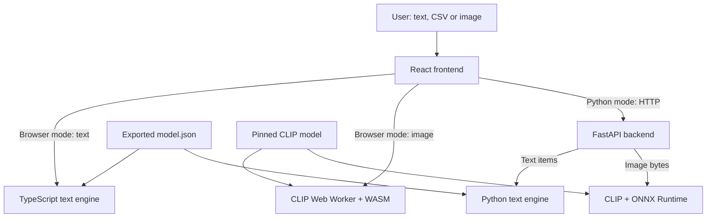

<div align="center">

# Sentiment Lab

**An interactive sentiment analysis platform** — text, CSV datasets, and image tone analysis with an inspectable ML pipeline.


Analyze English reviews, comments and messages; watch stop-word removal, stemming, and TF-IDF features feed a logistic-regression classifier; evaluate the model against labeled data — and explore the visual tone of images with a CLIP vision model.

</div>

---

## Table of Contents

- [Highlights](#highlights)
- [How it works](#how-it-works)
- [Run locally](#run-locally)
- [Configuration](#configuration)
- [API reference](#api-reference)
- [Retraining the text model](#retraining-the-text-model)
- [Image sentiment analysis](#image-sentiment-analysis)
- [Model & limitations](#model--limitations)
- [Project structure](#project-structure)
- [Verification](#verification)
- [Troubleshooting](#troubleshooting)

---

## Highlights

| Capability | Description |
| --- | --- |
| **Text sentiment** | Positive / neutral / negative classification for English reviews, comments, and messages |
| **Image visual tone** | Estimates the mood of JPG / PNG / WebP images using a quantized CLIP model |
| **CSV analysis** | Import datasets, inspect predictions, and export results as CSV |
| **Model evaluation** | Accuracy, macro precision / recall / F1, per-class metrics, and a confusion matrix |
| **Transparent pipeline** | Inspect cleaned text, removed stop words, stemmed tokens, and ranked TF-IDF features |
| **Dual inference engines** | Same text model runs in the browser (TypeScript) or on a Python FastAPI backend |

---

## How it works

The classic NLP pipeline, made visible:

| Step | Implementation |
| --- | --- |
| **Collection** | Text box or CSV upload |
| **Preprocessing** | Lowercase, URL removal, contraction expansion, tokenization, stop-word removal, suffix stemming |
| **Feature extraction** | Unigrams + bigrams, sublinear term frequency, smoothed IDF, L2 normalization |
| **Classification** | Multinomial logistic regression trained with scikit-learn |
| **Evaluation** | Predictions compared against known labels with class-level metrics |

Negation words such as `not`, `no`, and `never` are intentionally retained. Model scores are softmax probabilities — not calibrated confidence estimates.

### Component architecture



---

## Run locally

**Requirements:** Python 3.11+, Node.js 22.13+.

```bash
# Terminal 1 — Python backend
python -m venv .venv
# Windows: .venv\Scripts\Activate.ps1  |  macOS/Linux: source .venv/bin/activate
python -m pip install -r backend/requirements.txt
python -m uvicorn backend.main:app --reload --host 127.0.0.1 --port 8000

# Terminal 2 — React frontend
npm install
npm run dev
```

- Frontend: **http://localhost:5173**
- API docs: **http://127.0.0.1:8000/docs**
- No API key required. Text analysis works immediately; the first image analysis downloads ~160 MB of CLIP model files.

### CSV format

```csv
text,label
"I love this useful app!",positive
"The service was awful and slow.",negative
"The meeting starts at nine.",neutral
```

A `text` column is required; `label` is optional for analysis but required on every row for evaluation. Limits: 200 texts, 5,000 characters per text, 1 MB per CSV.

---

## Configuration

Copy `.env.example` to `.env`:

```dotenv
VITE_API_URL=http://127.0.0.1:8000
VITE_INFERENCE_MODE=python
```

| Variable | Values | Purpose |
| --- | --- | --- |
| `VITE_API_URL` | Any backend URL | Base URL of the FastAPI backend |
| `VITE_INFERENCE_MODE` | `python` / `browser` | Backend API vs. self-contained browser inference |
| `ALLOWED_ORIGINS` | Comma-separated list | CORS origins for the backend |
| `CLIP_MODEL_DIR` | Local folder path | Offline CLIP model files for Python image mode |

**Production build:**

```bash
npm run build
npm run preview
```

Output: `dist/`. For a deployed Python-backed app, point `VITE_API_URL` at the HTTPS backend URL and rebuild. Configure authentication and request limits before exposing the API publicly.

---

## API reference

| Method | Path | Purpose |
| --- | --- | --- |
| `GET` | `/api/health` | Health and model version |
| `GET` | `/api/model` | Model information and test report |
| `POST` | `/api/analyze` | Analyze text items |
| `POST` | `/api/evaluate` | Analyze labeled items and calculate metrics |
| `POST` | `/api/analyze-image` | Analyze raw JPG/PNG/WebP bytes |

**Text request body** (labels required only for evaluation):

```json
{"items":[{"text":"I love this app!","label":"positive"}]}
```

**Image request:**

```bash
curl -X POST http://127.0.0.1:8000/api/analyze-image \
  -H "Content-Type: image/jpeg" \
  --data-binary @photo.jpg
```

Returns `result.label`, `result.unclear`, `result.probabilities`, `result.matches`, `result.model`, and `result.engine`. Error statuses: `413` oversized, `415` unsupported content type, `422` invalid bytes, `503` model unavailable.

---

## Retraining the text model

Replace `data/train.csv` and `data/test.csv` with your own UTF-8 `text,label` datasets (all three classes must appear in training), then:

```bash
python -m pip install -r backend/requirements-train.txt
python -m backend.train
```

This regenerates `public/model.json` with vocabulary, IDF, coefficients, intercepts, and an evaluation report. Restart both servers afterward. scikit-learn is used for training only — the runtime text engine uses Python's standard library.

---

## Image sentiment analysis

Select a JPG/PNG/WebP (max 10 MB, 36 megapixels, aspect ratio ≤ 20:1) and **Analyze image**. The image is prepared on a white background, capped at 1600 px, center-cropped to 224 × 224, then compared against nine fixed scene descriptions using the quantized **CLIP ViT-B/32** model.

- Scores are softmax similarities summed per class — relative comparisons, not calibrated probabilities.
- Results below 50% or within 10 points of the runner-up are marked **Mixed / unclear**.
- **Browser mode:** runs in a Web Worker via Transformers.js + WASM; images stay on the device.
- **Python mode:** ONNX Runtime runs on CPU; the backend auto-downloads model files from Hugging Face.
- **Offline:** set `CLIP_MODEL_DIR` to a local folder with the model's ONNX + tokenizer + preprocessor files.

The model is `Xenova/clip-vit-base-patch32` (pinned revision, quantized). This feature estimates subjective scene tone — it does not read internal emotions and may misread memes, irony, or text-heavy screenshots.

**Model reference:** [CLIP ONNX](https://huggingface.co/Xenova/clip-vit-base-patch32) · [Transformers.js image classification](https://huggingface.co/docs/transformers.js/v3.8.1/en/api/pipelines)

---

## Model & limitations

The included text model was trained on **150 hand-authored examples** and evaluated on **36 separate test examples**, balanced across the three classes.

| Metric | Value |
| --- | --- |
| Accuracy | 86.1% |
| Macro precision | 86.0% |
| Macro recall | 86.1% |
| Macro F1 | 86.0% |

This small synthetic dataset is an **educational demonstration**, not a representative benchmark. Sarcasm, mixed sentiment, unfamiliar domains, complex negation, Hindi/Hinglish, and emojis can fail. Unknown-feature text is flagged as *insufficient signal*.

---

## Project structure

```
├── app/                    # React interface (workspace, image workspace, styles)
├── backend/                # FastAPI server, text/image engines, training
├── components/ui/          # Accessible tabs, progress, tables
├── lib/                    # Browser inference, image worker, API client
├── src/                    # React entry + environment configuration
├── public/                 # model.json, sample.csv, favicon
├── data/                   # training + test CSVs
├── scripts/                # verification and helper scripts
└── .env.example            # environment template
```

---

## Verification

```bash
python -m pip install -r backend/requirements-train.txt
python -m unittest backend.test_api backend.test_images -v
node --experimental-strip-types scripts/test-engine.mjs
npm run build
node scripts/check-image-worker.mjs dist
```

Checks cover the API, all three classes, preserved negation, evaluation arithmetic, Python/TypeScript parity on 41 inputs, CSV edge cases, and safe CSV export.

---

## Troubleshooting

| Problem | What to check |
| --- | --- |
| Cannot reach the Python API | Start the backend, check `/api/health`, confirm `VITE_API_URL`, restart Vite after changing `.env` |
| CORS error in the browser | Add the exact frontend origin to `ALLOWED_ORIGINS` before starting Python |
| First image analysis is slow | Initial model download; check connectivity and memory |
| Image model fails to load | Verify dependencies/connectivity or use `CLIP_MODEL_DIR` |
| "Evaluate labels" is disabled | Every CSV row needs `positive`, `neutral`, or `negative` |
| Insufficient signal for text | Input has no known features; use representative English text or retrain |
| Image shows **Mixed / unclear** | Scores have no decisive lead; inspect the descriptions and use context |

---

## References

- [TF-IDF](https://scikit-learn.org/stable/modules/generated/sklearn.feature_extraction.text.TfidfVectorizer.html)
- [Logistic regression](https://scikit-learn.org/stable/modules/generated/sklearn.linear_model.LogisticRegression.html)
- [Evaluation metrics](https://scikit-learn.org/stable/modules/generated/sklearn.metrics.classification_report.html)
- [FastAPI](https://fastapi.tiangolo.com/)
- [React](https://react.dev/)